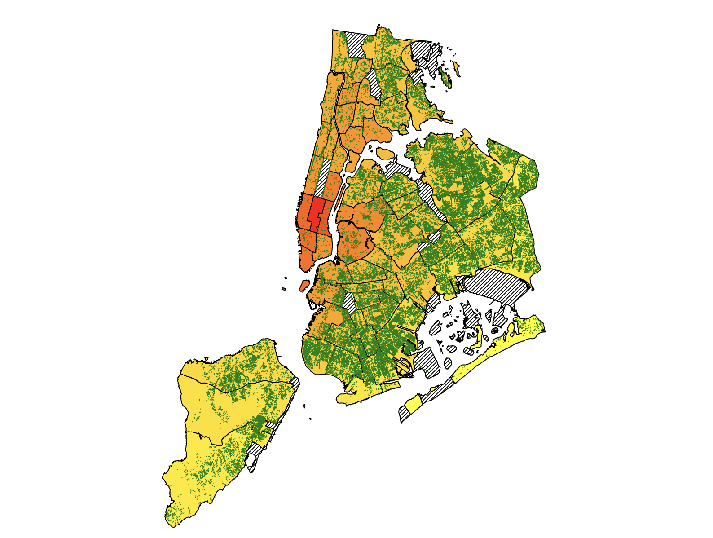

# NYTrees

Welcome to the NYTrees repository! This project uses d3.js to analyze the distribution of trees in New York and explores the different effects these trees have on the community. The analysis includes examining the relationship between tree distribution, poverty levels, and air quality (measured with air particles) in various areas of New York.

## Getting Started

To interact with the d3.js application and explore the data visualization, follow these steps:

1. **Clone the Repository:** Begin by cloning this repository to your local machine using the following command:
``` bash
git clone github.com/jh991205/NYTrees
```


2. **Navigate to the Directory:** Once cloned, change your current working directory to the NYTrees folder:

``` bash
cd NYTrees
```


3. **Run a Local Server:** To run the d3.js application locally, you need to set up a simple Python server. If you have Python installed, you can use the built-in `http.server` module. Execute the following command in the NYTrees directory:

``` bash
python -m http.server
```

This will start the server, allowing you to access the application through a web browser.

4. **Access the Application:** Open your web browser and go to the following URL:

```
http://localhost:8000/index.html
```


This will load the index.html page, where you can begin exploring the distribution of trees in New York and its relationship with other factors.

## How to Use the Application

The d3.js application provides an interactive data visualization of tree distribution in New York. You can analyze the data in depth by using various features such as zooming in and out and panning on the graphs. The application highlights the relationship between tree distribution and the following factors:

- **Poverty:** Explore how the distribution of trees varies across areas with different poverty levels in New York.

- **Air Quality:** Investigate the impact of tree distribution on air quality, measured with air particles, in different regions of the city.



Each green circle on the map represents an individual tree. The map is colored according to the air particles in the corresponding community district.

## License

This project is licensed under the Apache 2.0 License, which means you are free to use, modify, and distribute the code. However, please be aware of any dependencies or third-party libraries that may have their own licensing terms.


